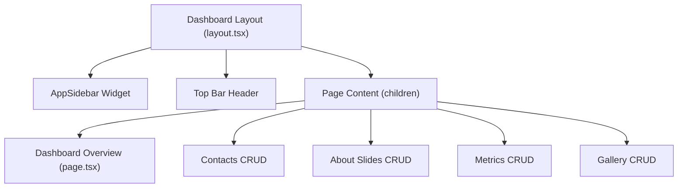

# Admin Panel & Dashboard Architecture

This document describes how the Admin Panel is structured, its components, layout architecture, routing, and access control policies.

## Structure and Layout

The Admin Dashboard codebase resides in `src/app/dashboard/`. It uses a nested layout design pattern:



### Main Layout File
The root layout for all dashboard pages is **[layout.tsx](file:///d:/sck/sck-4/src/app/dashboard/layout.tsx)**. It initializes:
*   `SidebarProvider` context.
*   `AppSidebar` navigation component with collapsible menu states.
*   Header Top Bar containing profile data of the logged-in admin user and trigger handles.
*   Global `AlertDialog` confirm dialogs for logging out.

---

## CRUD Component Pages

The dashboard contains four separate administrative views that manage the landing page assets:

1.  **Overview Dash ([page.tsx](file:///d:/sck/sck-4/src/app/dashboard/page.tsx))**:
    Queries the database using Drizzle to retrieve statistics (total records, slide counts, active contact details) and displays them in card layouts.
2.  **Manage Contacts ([contacts/page.tsx](file:///d:/sck/sck-4/src/app/dashboard/contacts/page.tsx))**:
    Manages emails, phone numbers, addresses, and social handle URLs. Ensures that only one contact set is marked as `isActive: true` at a time.
3.  **Manage Slides ([about-slides/page.tsx](file:///d:/sck/sck-4/src/app/dashboard/about-slides/page.tsx))**:
    Handles carousels, text captions, tags, and custom image weights for the landing page hero slider.
4.  **Manage Metrics ([metrics/page.tsx](file:///d:/sck/sck-4/src/app/dashboard/metrics/page.tsx))**:
    Maintains counter statistics and indicators (such as experience years, client counts, etc.) displayed on the landing page.
5.  **Manage Gallery ([gallery/page.tsx](file:///d:/sck/sck-4/src/app/dashboard/gallery/page.tsx))**:
    Manages direct integration with Cloudinary for image hosting, masonry filters, captions, and highlights.

---

## Security & Authentication

Access to the admin dashboard is restricted on two levels:

### 1. Route Handlers (API Layer)
Every writing or deleting endpoint (POST, PUT, DELETE) verifies session validity before executing SQL commands using NextAuth:

```typescript
import { auth } from "@/lib/auth";

export async function POST(req: Request) {
  const session = await auth();
  if (!session || session.user.role !== "ADMIN") {
    return NextResponse.json({ error: "Unauthorized" }, { status: 401 });
  }
  // ... proceed safely
}
```

### 2. Client Pages (UI Layer)
The authentication session is verified client-side using `useSession` from `next-auth/react`. If the session is invalid or loading, it triggers redirects or presents login options.

> [!NOTE]
> For security, the site auth credentials use JWT strategy set with a maximum age limit of 3 days. Any change to the user structure or role in the db will automatically reflect on their session status.
