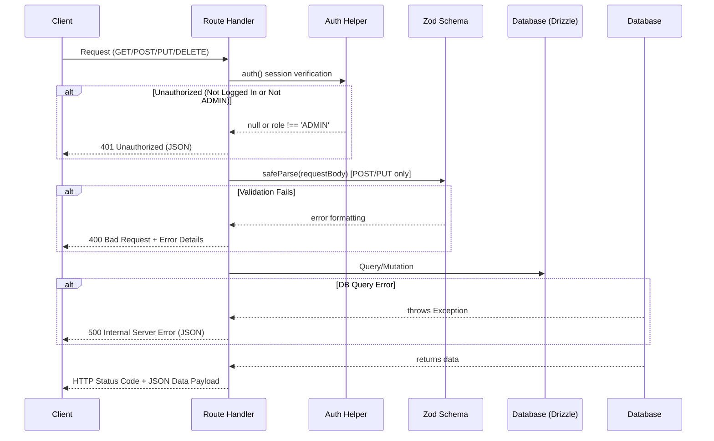

# API Coding Standards

This guide outlines the backend API development standards, payload validation rules, session authorization policies, and error-handling architectures.

## Overview

All backend endpoints are built using **Next.js App Router API Route Handlers** under `src/app/api/`. 



---

## Standard Endpoint Templates

Here is the standard implementation blueprint for API route handlers in this project.

### 1. Resource Collection Endpoint (GET & POST)
File: `src/app/api/my-resource/route.ts`

```typescript
import { NextResponse } from "next/server";
import { db } from "@/lib/db";
import { myResourceTable } from "@/db/schema/my_resource";
import { auth } from "@/lib/auth";
import { desc, sql } from "drizzle-orm";
import { z } from "zod";
import { parsePaginationParams, createPaginationMeta } from "@/lib/pagination";

// 1. Define Request Zod Schema
const resourceSchema = z.object({
  title: z.string().min(1, "Title is required"),
  description: z.string().optional(),
});

// 2. GET Handler (Public or Private depending on feature)
export async function GET(req: Request) {
  try {
    const { searchParams } = new URL(req.url);
    const { page, limit, offset } = parsePaginationParams(searchParams);

    const countResult = await db
      .select({ count: sql<number>`count(*)` })
      .from(myResourceTable);
    const total = Number(countResult[0]?.count || 0);

    const data = await db
      .select()
      .from(myResourceTable)
      .orderBy(desc(myResourceTable.createdAt))
      .limit(limit)
      .offset(offset);

    return NextResponse.json({
      data,
      pagination: createPaginationMeta({ page, limit, total }),
    });
  } catch (error) {
    console.error("GET my-resource error:", error);
    return NextResponse.json(
      { error: "Failed to fetch resource items" },
      { status: 500 }
    );
  }
}

// 3. POST Handler (Admin Authorized Only)
export async function POST(req: Request) {
  try {
    const session = await auth();
    if (!session || session.user.role !== "ADMIN") {
      return NextResponse.json({ error: "Unauthorized" }, { status: 401 });
    }

    const body = await req.json();
    const parsed = resourceSchema.safeParse(body);
    if (!parsed.success) {
      return NextResponse.json(
        { error: "Invalid data validation", details: parsed.error.format() },
        { status: 400 }
      );
    }

    const inserted = await db
      .insert(myResourceTable)
      .values(parsed.data)
      .returning();

    return NextResponse.json(inserted[0], { status: 201 });
  } catch (error) {
    console.error("POST my-resource error:", error);
    return NextResponse.json(
      { error: "Failed to create resource item" },
      { status: 500 }
    );
  }
}
```

### 2. Single Resource Detail Endpoint (PUT & DELETE)
File: `src/app/api/my-resource/[id]/route.ts`

```typescript
import { NextResponse } from "next/server";
import { db } from "@/lib/db";
import { myResourceTable } from "@/db/schema/my_resource";
import { auth } from "@/lib/auth";
import { eq } from "drizzle-orm";

export async function PUT(
  req: Request,
  { params }: { params: { id: string } }
) {
  try {
    const session = await auth();
    if (!session || session.user.role !== "ADMIN") {
      return NextResponse.json({ error: "Unauthorized" }, { status: 401 });
    }

    const body = await req.json();
    // Validate with schema...

    const updated = await db
      .update(myResourceTable)
      .set(body)
      .where(eq(myResourceTable.id, params.id))
      .returning();

    if (updated.length === 0) {
      return NextResponse.json({ error: "Resource not found" }, { status: 404 });
    }

    return NextResponse.json(updated[0]);
  } catch (error) {
    console.error("PUT my-resource error:", error);
    return NextResponse.json({ error: "Failed to update resource" }, { status: 500 });
  }
}

export async function DELETE(
  req: Request,
  { params }: { params: { id: string } }
) {
  try {
    const session = await auth();
    if (!session || session.user.role !== "ADMIN") {
      return NextResponse.json({ error: "Unauthorized" }, { status: 401 });
    }

    const deleted = await db
      .delete(myResourceTable)
      .where(eq(myResourceTable.id, params.id))
      .returning();

    if (deleted.length === 0) {
      return NextResponse.json({ error: "Resource not found" }, { status: 404 });
    }

    return NextResponse.json({ success: true, deleted: deleted[0] });
  } catch (error) {
    console.error("DELETE my-resource error:", error);
    return NextResponse.json({ error: "Failed to delete resource" }, { status: 500 });
  }
}
```

---

## Validation and Status Code Reference

Always stick to the following standard HTTP Response statuses:

| Status Code | Meaning | Use Case |
|---|---|---|
| **200 OK** | Success | Returned for successful GET, PUT, or DELETE requests. |
| **201 Created** | Created | Returned for successful POST requests. |
| **400 Bad Request** | Validation Failure | Zod schema parse fail, parameter values out of range, bad payload JSON. |
| **401 Unauthorized** | Authentication Required | No session, token expired, or user.role is not `ADMIN`. |
| **404 Not Found** | Missing Resource | The ID passed in route parameter does not match any entry in the DB. |
| **500 Internal Server Error** | Unexpected Failure | Database connectivity failures, script errors, or uncaught execution exceptions. |
