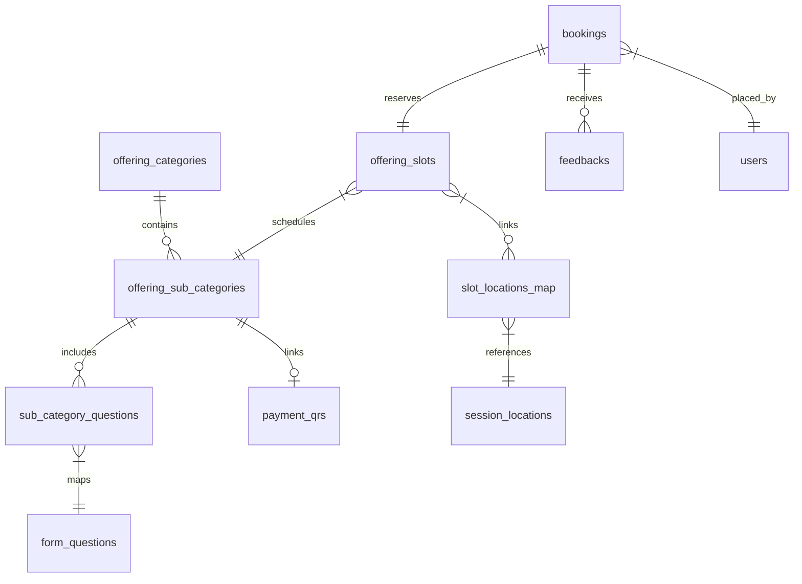

# Offerings & Slot Booking System: Technical Specification

This document defines the requirements, database schemas, API structures, front-end behaviors, and notification flows for transitioning the homepage static "Offerings" section into a dynamic, admin-managed CRUD system.

---

## 1. Database Schema

### Table Specifications

#### A. `offering_categories`

- `id` (UUID, Primary Key)
- `name` (VARCHAR, Not Null)
- `description` (TEXT)
- `sanskrit_text` (VARCHAR, Optional)
- `sanskrit_meaning` (TEXT, Optional)
- `sort_order` (INTEGER, Default 0)
- `is_active` (BOOLEAN, Default True)
- `created_at` (TIMESTAMP, Default Now)

#### B. `offering_sub_categories`

- `id` (UUID, Primary Key)
- `category_id` (UUID, Foreign Key ➔ `offering_categories.id`, Cascade Delete)
- `payment_qr_id` (UUID, Foreign Key ➔ `payment_qrs.id`, Nullable)
- `name` (VARCHAR, Not Null)
- `description` (TEXT)
- `top_tags` (TEXT[], array of highlighted pills e.g. "Popular")
- `tags` (TEXT[], general descriptive tags)
- `requires_booking` (BOOLEAN, Default True - if False, it's a direct form submission)
- `sort_order` (INTEGER, Default 0)
- `is_active` (BOOLEAN, Default True)
- `created_at` (TIMESTAMP, Default Now)

#### C. `session_locations` (Location Assets)

Configurable set of meeting formats and addresses.

- `id` (UUID, Primary Key)
- `name` (VARCHAR, Not Null - e.g., "Google Meet 1", "Zoom Link", "SCK Location Room A")
- `type` (Enum: `online`, `offline`, Not Null)
- `url` (TEXT, Not Null - stores the actual Zoom/Google Meet link OR Google Maps location pin)
- `created_at` (TIMESTAMP, Default Now)

#### D. `payment_qrs`

- `id` (UUID, Primary Key)
- `name` (VARCHAR, Not Null)
- `qr_image_url` (TEXT, Not Null - Cloudinary URL)
- `created_at` (TIMESTAMP, Default Now)

#### E. `form_questions` (Reusable Question Library)

Independent questions pool available to be linked across multiple offerings.

- `id` (UUID, Primary Key)
- `field_label` (TEXT, Not Null)
- `field_type` (Enum: `short_answer`, `long_answer`, `date`, `time`, `number`, `star_rating`, `single_select`, `multi_select`, `url`)
- `options` (JSONB, Optional - e.g. `["Option A", "Option B"]`)
- `allow_other` (BOOLEAN, Default False - if True, choosing "Other" renders a text input)
- `created_at` (TIMESTAMP, Default Now)

#### F. `sub_category_questions` (Offering Form Linkage)

Junction table linking questions to sub-categories with custom display order.

- `id` (UUID, Primary Key)
- `sub_category_id` (UUID, Foreign Key ➔ `offering_sub_categories.id`, Cascade Delete)
- `question_id` (UUID, Foreign Key ➔ `form_questions.id`, Cascade Delete)
- `sort_order` (INTEGER, Default 0 - supporting Drag-and-Drop ordering per session)
- `is_required` (BOOLEAN, Default True)
- `created_at` (TIMESTAMP, Default Now)

#### G. `offering_slots`

- `id` (UUID, Primary Key)
- `sub_category_id` (UUID, Foreign Key ➔ `offering_sub_categories.id`, Cascade Delete)
- `slot_date` (DATE, Not Null)
- `start_time` (TIME, Not Null)
- `end_time` (TIME, Not Null)
- `status` (Enum: `available`, `booked`, `suspended`, Default `available`)
- `created_at` (TIMESTAMP, Default Now)

#### H. `slot_locations_map` (Slot-Location Mapping)

Allows linking multiple online/offline options to a single slot.

- `id` (UUID, Primary Key)
- `slot_id` (UUID, Foreign Key ➔ `offering_slots.id`, Cascade Delete)
- `location_id` (UUID, Foreign Key ➔ `session_locations.id`, Cascade Delete)

#### I. `bookings`

- `id` (UUID, Primary Key)
- `user_id` (UUID, Foreign Key ➔ `users.id`, Not Null)
- `slot_id` (UUID, Foreign Key ➔ `offering_slots.id`, Nullable)
- `sub_category_id` (UUID, Foreign Key ➔ `offering_sub_categories.id`, Not Null)
- `selected_format` (Enum: `online`, `offline`, Nullable)
- `selected_location_id` (UUID, Foreign Key ➔ `session_locations.id`, Nullable)
- `status` (Enum: `pending`, `confirmed`, `cancellation_pending`, `cancelled`, `completed`, Default `pending`)
- `form_responses` (JSONB, Key-Value answers from custom form)
- `user_cancellation_reason` (TEXT, Nullable)
- `admin_cancellation_reason` (TEXT, Nullable)
- `created_at` (TIMESTAMP, Default Now)

#### J. `feedbacks`

- `id` (UUID, Primary Key)
- `booking_id` (UUID, Foreign Key ➔ `bookings.id`, Cascade Delete)
- `rating` (INTEGER, Not Null)
- `raw_feedback` (TEXT, Not Null)
- `enhanced_feedback` (TEXT, Nullable)
- `is_active` (BOOLEAN, Default False)
- `created_at` (TIMESTAMP, Default Now)

---

## 2. Business Rules & Logic Guards

1. **Horizon Rule**: Same-day bookings are disabled. The user can only book slots starting from the next day.
2. **Double Booking Prevention**: Check that the admin is not announcing overlapping timings for the same sub-category on the same day.
3. **Slot Release**: If a booking is cancelled, the associated slot status changes back to `available`.
4. **Conditional "Other" Input**: For single-select and multi-select questions, if `allow_other` is `True`, an additional short-text field appears dynamically in the form when "Other" is chosen.
5. **Autofill Info**: User's Name, Email, and WhatsApp number must be pre-filled automatically using their active login session.

---

## 3. Realtime Updates Configuration

All tables must trigger real-time changes using the universal trigger function:

- Add triggers in `universal_triggers.sql` for:
  - `offering_categories`
  - `offering_sub_categories`
  - `session_locations`
  - `payment_qrs`
  - `form_questions`
  - `sub_category_questions`
  - `offering_slots`
  - `bookings`
  - `feedbacks`
- Run database trigger sync: `npm run db:trigger && npm run db:realtime`

---

## 4. WhatsApp Alerts & Notifications Workflow

- WhatsApp alerts are active if the `ADMIN_NOTIFICATION_PHONE` env variable is set.

| Status Step                    | WhatsApp Recipient                 | Notification Message                                                                                             |
| :----------------------------- | :--------------------------------- | :--------------------------------------------------------------------------------------------------------------- |
| **Booking Received (Pending)** | User                               | _"Dear {{Name}}, Your slot is pending for the booking {{Offering}} on {{Date}}. We will update in 12-24 hours."_ |
| **New Booking Alert**          | Admin (`ADMIN_NOTIFICATION_PHONE`) | _"New booking received from {{UserName}} for {{Offering}}! Review here: {{DashboardUrl}}"_                       |
| **Booking Confirmed**          | User                               | Timings details, format type, and meet link (Zoom/Meet) OR Google Map location link.                             |
| **Cancellation Request**       | Admin (`ADMIN_NOTIFICATION_PHONE`) | _"User {{UserName}} requested cancellation for {{Offering}} on {{Date}}. Reason: {{Reason}}"_                    |
| **Booking Cancelled**          | User                               | _"Dear {{Name}}, booking for {{Offering}} on {{Date}} cancelled. Reason: {{AdminReason}}"_                       |
| **Session Completed**          | User                               | Attaches the completed feedback link.                                                                            |

---

## 5. UI Requirements & UX Flows

### A. Dedicated Public Offerings Page (`/offerings`)

- Shipped entirely out of the homepage with the premium vanilla CSS theme, outfit fonts, and glassmorphism cards.
- Categories and sub-categories are listed dynamically in order of `sort_order`.

### B. Custom Monthly Calendar Component

- Renders a grid monthly calendar matching the screenshot.
- Dates containing active slots for the selected sub-category are highlighted.
- Previous dates, the current date (today), and previous months are disabled.
- Backwards month navigation is disabled; forward month navigation is allowed.
- Clicking an available date reveals the time slots. Clicking a slot proceeds to form submission.

### C. Login Redirect Guard

- If a guest clicks a slot, redirect them to `/login?callbackUrl=/offerings/[sub-category]/book`.
- Upon successful authentication, they are redirected back to the booking page automatically.

### D. User Dashboard ("My Bookings")

- Accessible from the user profile dashboard.
- Lists all bookings with active status badges.
- Displays Zoom/Map links for `confirmed` bookings.
- Includes triggers to request cancellation with reason.
- Includes "Submit Feedback" action for `completed` bookings.

### E. Admin Dashboard

- **Offerings Console**: CRUD interface for Categories and Sub-categories with re-ordering controls.
- **Form Builder**: Drag-and-drop ordering for fields, configuration of "Other" text fields.
- **Slots Announcer**: Select locations from `session_locations` to map formats to slots.
- **Bookings Grid**: URL-paginated (e.g. `?page=1&limit=25`) grid showing bookings without noise.
- **Feedback Manager**: Rewrite reviews into `enhanced_feedback` and toggle `is_active` for testimonials display.
