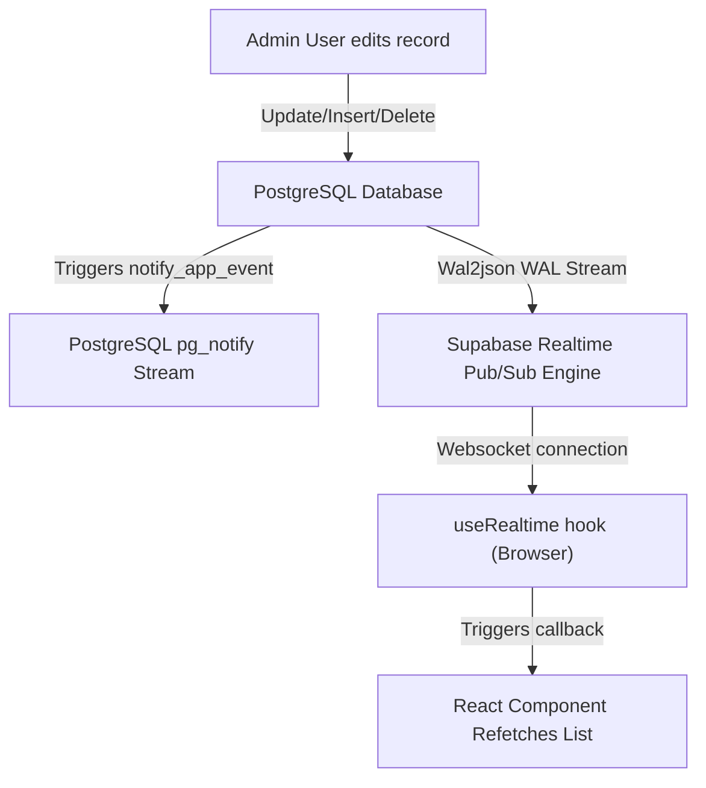

# Realtime considerations & Pub/Sub Guide

This guide details how live data synchronization is structured using PostgreSQL notifications, database replication channels, and the client-side `useRealtime` hook.

## Realtime Architecture

Our system enables real-time synchronization of the landing page data and admin panel tables using **Supabase Realtime** subscription channels:



---

## Database Requirements for Realtime

For a table to support real-time streaming, it must undergo three database updates:

### 1. Replica Identity Configuration
By default, PostgreSQL only broadcasts updated row values. To enable clients to process deletions or identify modified records by their previous state, the replica identity must be set to `FULL`:
```sql
ALTER TABLE public.contacts REPLICA IDENTITY FULL;
```

### 2. Publication Association
The table must be explicitly added to the database publication channel registered in Supabase:
```sql
ALTER PUBLICATION supabase_realtime ADD TABLE public.contacts;
```

### 3. RLS Select Policy Activation
Since real-time clients connect via public WebSockets using the anonymous key, RLS select policies must allow anonymous select authorization:
```sql
ALTER TABLE public.contacts ENABLE ROW LEVEL SECURITY;

CREATE POLICY "realtime_select_contacts" ON public.contacts
  FOR SELECT TO anon USING (true);
```

> [!NOTE]
> All these configurations are automated for all tables in the `public` schema within **[realtime.sql](file:///d:/sck/sck-4/triggers/realtime.sql)**.

---

## Client-Side `useRealtime` Hook

We manage real-time updates inside React components using the custom **[useRealtime.ts](file:///d:/sck/sck-4/src/hooks/useRealtime.ts)** hook.

### Key Features of `useRealtime`:
1.  **Reference Counting & Shared Subscriptions**: If multiple components listen to the same database table, they share a single WebSocket channel subscription. The channel is cleaned up only when all listeners unmount.
2.  **Robust Reconnection Engine**: If a network failure occurs, the hook schedules resubscribes using a retry schedule with exponential backoff:
    `RETRY_DELAYS = [500ms, 1000ms, 2000ms, 5000ms, 10000ms]` + random jitter.
3.  **Automatic Lifecycle Cleanups**: Safely detaches listeners and deletes connections on unmount to prevent resource and memory leaks.

---

## How to Integrate the Hook

Simply provide the table names you wish to watch and a callback function. Usually, the callback triggers a list refetch:

```typescript
import { useRealtime } from "@/hooks/useRealtime";

function MyComponent() {
  const [data, setData] = useState([]);

  const fetchData = async () => {
    const res = await fetch("/api/my-resource");
    const json = await res.json();
    setData(json.data);
  };

  // Watch for any changes to "contacts" or "gallery" tables
  useRealtime(["contacts", "gallery"], () => {
    console.log("Database table changed, refetching dynamic resources...");
    fetchData();
  });

  useEffect(() => {
    fetchData();
  }, []);

  // ... render view
}
```

> [!WARNING]
> Keep listener callback logic lightweight. Avoid writing database queries *inside* the hook's callback, as they can cause infinite loops if they mutate the same table they listen to.
